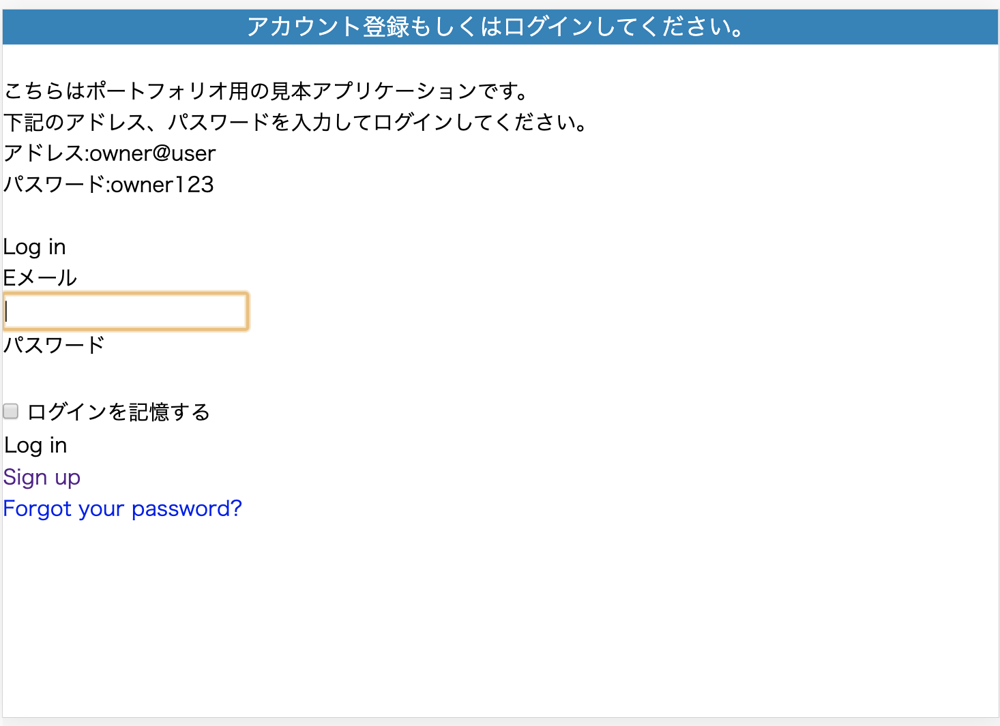
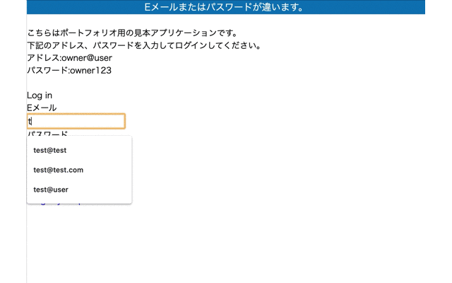
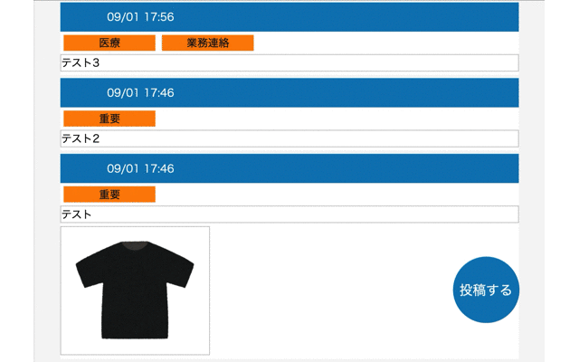

# 情報共有アプリ

## 概要
介護施設で実際に使用した、情報共有アプリです。 
簡単な操作で画像を共有でき、より正確にかつ簡単に情報共有を行うことができます。

## アクセス方法
#### 1. こちらからアクセスいただけます。 [https://request-app-422.herokuapp.com/](https://request-app-422.herokuapp.com/)

#### 2. Basic認証画面に以下のID、Passを入力してください。
- ID:admin
- Pass:2222
  
#### 3. ログイン画面が表示されますので、以下のアドレス、パスワードを入力しログインしてください。
- メールアドレス:owner@user
- パスワード:owner123

## なぜこのアプリを作ったか
### 【背景】
勤務先の介護施設では情報共有時に抜け漏れが発生したり、正確に伝わらないといった課題がありました。 
これらのミスによってご利用者様にご迷惑をかけてしまうこともあり、どうにか解決できないかと考えたことがアプリ作成のきっかけです。

### 【原因】
ミス発生の原因には、以下3点があると考えました。
- 記録する時間がなく、抜け漏れが発生してしまう 
- 文章や口頭だけでは正確に情報が伝わらない 
- 参照資料が多く、効率よく情報を把握できない 

### 【解決策】
以下3点の理由から 
共有すべき情報を写真に納め、当日のまとめとして登録できるアプリを考えました。

- 記録する時間がない→写真をとるだけなら数十秒で完了するため、記録時間の短縮になるのではないか？

- 文章、口頭では伝わりにくい
→写真を活用し解釈のズレ発生を防げるのではないか？

- 参考資料多く情報把握が非効率
→当アプリに情報をまとめることで情報収集の効率をあげることができるのではないか？

### 【結果】
14日間使用 
- 情報共有のミス0件 
- 投稿写真の枚数が少ないなどアプリの効果を十分には実感できなかった 

## 工夫したポイント
### 【セキュリティの強化】
実際に社内で活用するため、セキュリティ面の強化に力を入れました。 
- アカウントによって機能を制限 
社内スタッフのみ投稿、閲覧ができるよう権限管理機能を実装しました。 
#### ※管理者アカウントでログインした場合は閲覧、投稿機能を利用できます

#### ※管理者以外のアカウントでログインした場合は閲覧、投稿はできません

- 特定のユーザーのみサイトを閲覧できる 
Basic認証を設定し、外部のユーザーが閲覧できないようにしました。

- 知見のある方の意見を取り入れる 
スキルシェアサービスを利用し、現役エンジニアの方からセキュリティ面に関してアドバイスをいただきました。 
自分だけでは気づかなかった部分をご指摘いただけたことで、会社でも安心して使用してもらうことができました。 

### 【使いやすさ】
最低限の機能のみ実装し、意見をもらいながら修正を繰り返すことで現場で使ってもらえるアプリを意識しました。 
- 写真拡大機能 
 
写真が見づらいという意見をいただき、写真を拡大表示させる機能を実装しました。 
既存のサービスをCDNで利用することでアプリ使用を中断することなくスピーディーな機能実装ができました。 

## 今後の課題

### 【実用的なアプリケーションを開発できるようになる】
試用期間中では投稿される写真の枚数が少ない、意図していない使われ方になってしまったなど 
課題に対して十分に効果的なアプリケーションを開発することができませんでした。 
今後は開発から運用保守といったプロセス全体においてユーザー目線を強く意識し、
本当に役立つアプリを開発できるようになりたいです。

### 【技術力を向上させる】
写真を投稿時にトリミングする機能が必要になったのですが、技術力不足により実装できませんでした。 
今後も学習を継続し、様々な言語、フレームワークの理解を深めどんな機能でも実装できる技術力を身に付けたいです。

## 開発環境
Ruby / Ruby on Rails / JavaScript / jQuery / Postgres /
HTML / CSS / SCSS / AWS (EC2 / S3 / IAM) / Capistrano / Heroku /

## アプリ機能
投稿閲覧機能 / 画像投稿機能 / カテゴリ付け機能 / カテゴリ検索機能 / 権限管理機能 / ユーザー新規登録機能 / ユーザーログイン・ログアウト機能 / 画像拡大表示機能 /

## DB設計
### informationsテーブル

|Culumn|Type|Option|
|------|----|-------|
|cotent|text|null: fallse|

#### Association
- has_many :images
- has_many :informations_categorys
- has_many :categorys, through: informations_categorys

### imagesテーブル

|Culumn|Type|Option|
|------|----|-------|
|url|string|null: fallse|
|information-id|reference|null: fallse, foreign_key: true|

#### Association
- belongs_to :information

### categorysテーブル

|Culumn|Type|Option|
|------|----|-------|
|name|string||

#### Association
- has_many :informations_categorys
- has_many :informations, through: informations_categorys

### informations_categorysテーブル

|Culumn|Type|Option|
|------|----|-------|
|information-id|reference|null: fallse, foreign_key: true|
|category-id|references|null: fallse, foreign_key: true|

#### Association
- belongs_to :information
- belongs_to :category

